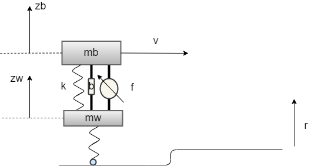
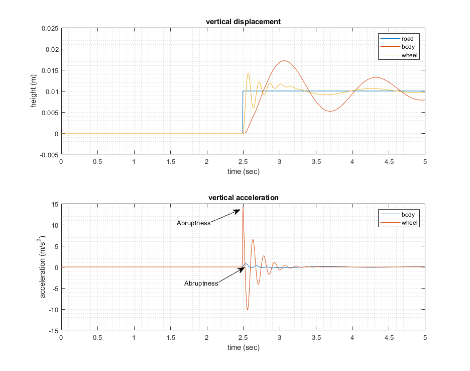

Consider a quarter car model moving at a constant speed to encounter a step change in the road profile. Without active suspension control, both the wheel (mw) and the body (mb) will have large vertical acceleration caused by the road input. For more details about a quarter car model, please refer to https://www.mathworks.com/help/robust/gs/active-suspension-control-design.html

You are given an initial MATLAB script that simulates this scenario with passive suspension (i.e., the force command is always 0). After running the script, you should see the following results

Notice that the large peak-to-peak values in the wheel vertical acceleration may damage the vehicle, and the ones on the body acceleration may affect comfort for the ride. Now, assuming the road profile is accurately known ahead of time, your tasks are:

* Design an open-loop force command to improve the performance of the vehicle wheel and/or body vertical motion over such an event.
* If the vehicle speed is allowed to change over time, design an open-loop force command together with a referene speed profile over such an event. Note that you may want to penalize the speed changes in the cost function.

Note that:
- It is up to you to reuse the code, or create your own simulation in other languages / environments.
- There are two main constraints:
  - Max force: abs(f) < 2000 N
  - Max suspension travel: abs(zb-zw) < 0.1 m
- You can design your own cost function

In your answers, please
- Provide the simulation code and simulation results
- Provide a short summary (half a page is good enough) to explain your answer.

